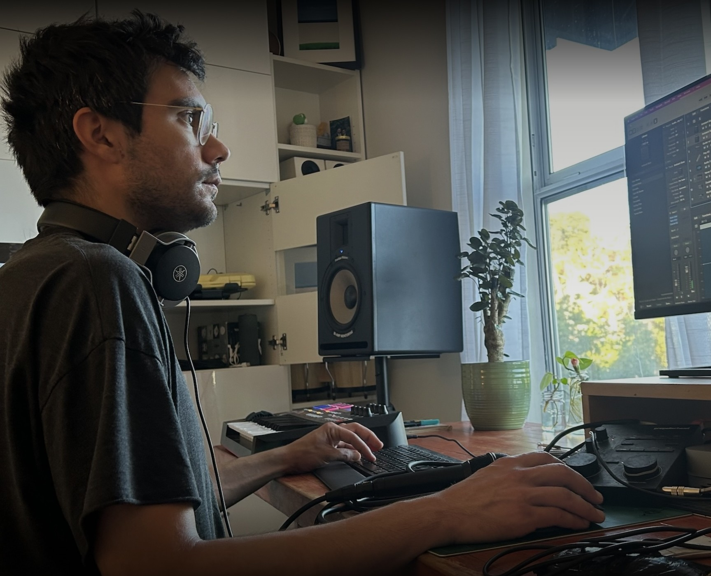

# Hello, I am Ryan.

Creative tool-maker with 10yr experience building & scaling computer graphics software products. I've always been fascinated by computer programs that draw pictures and am currently exploring interactive & temporal Gaussian Splatting. 

📍 Paris, FR

 ## 🚀 What I Do

- Product Engineering in realtime, offline and neural graphics-related projects.
- Technical Sales/Growth work: GTM/Forward-Deployed Engineering, Developer Advocacy and Technical Content Creation.

## 💡 Previously

- Built AI/3D Animation [storytelling software](https://www.youtube.com/@MovieBotTV) that reached ~2M young creators.
- Built interactive 3D [Education Technology](https://viewer.10k.science) for high school students to better visualize science.
- Worked on [OpenUSD](https://github.com/PixarAnimationStudios/OpenUSD) infrastructure at DreamWorks Animation.

## 🌐 Find Me Online

- Portfolio: [reedery.github.io](https://reedery.github.io/)
- Reach out to me via [email](mailto:reede.ryan@gmail.com)

---

